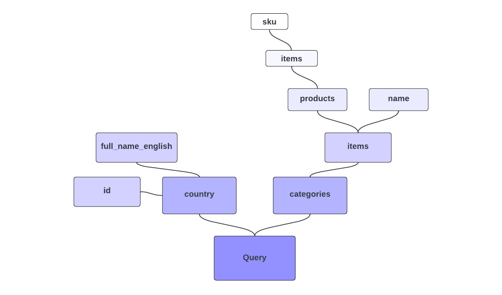

# GraphQL Queries

Let's dive right into GraphQL query syntax with a pretty full-fledged example. 

> Remember, you can try this yourself against https://venia.magento.com/graphql.

Observe the following GraphQL query, which we'll break down piece by piece:

```graphql
{
    country (
        id: "US"
    ) {
        id
        full_name_english
    }

    categories(
        filters: {
            name: {
                match: "Tops"
            }
        }
    ) {
        items {
            name
            products(
                pageSize: 10,
                currentPage: 2
            ) {
                items {
                    sku
                }
            }
        }
    }
}
```

A plausible response from a GraphQL server for the above query could be: 

```json
{
  "data": {
    "country": {
      "id": "US",
      "full_name_english": "United States"
    },
    "categories": {
      "items": [
        {
          "name": "Tops",
          "products": {
            "items": [
              {
                "sku": "VSW06"
              },
              {
                "sku": "VT06"
              },
              {
                "sku": "VSW07"
              },
              {
                "sku": "VT07"
              },
              {
                "sku": "VSW08"
              },
              {
                "sku": "VT08"
              },
              {
                "sku": "VSW09"
              },
              {
                "sku": "VT09"
              },
              {
                "sku": "VSW10"
              },
              {
                "sku": "VT10"
              }
            ]
          }
        }
      ]
    }
  }
}
```

The above example relies on the out-of-the-box GraphQL schema for Magento, defined at the server. In this request, we're
querying multiple types of data at once, the query expresses exactly the fields we want, and the returned data is formatted
very similarly to the query itself.

> GraphQL clients obfuscate the form of the actual HTTP request being sent, but this is easy to discover. If you're using
> a browser-based client, observe the Network tab when a query is sent, and you'll see that the request contains a raw
> body consisting of "query: `{string}`", where `{string}` is simply the raw string of your entire query. If
> the request is being sent as a GET, the query might be encoded in the querystring parameter "query" instead. Unlike
> with REST, the HTTP request type doesn't matter, only the contents of the query.

## Querying for What We Want

`country` and `categories` in our example represent two different "queries," for two different kinds
of data. Unlike a traditional API paradigm like REST, which would define separate and explicit endpoints for each data type, 
GraphQL gives us the flexibility to query a single endpoint with an expression that can fetch many types of data at once.

Likewise, the query specifies exactly the fields that are desired for both `country` (`id` and `full_name_english`) 
and `categories` (`items`, which itself has a sub-selection of fields), and the data we receive back mirrors that field specification. 
There are presumably many more fields available for these data types, but we will get back only what we asked for.

> You may notice that the return value for `items` is actually an _array_ of values, but we are nevertheless directly selecting
> sub-fields for it. When a field's type is a list, GraphQL implicitly understands sub-selections to apply to each item 
> in the list.

## Arguments

While the fields we want returned are specified within the braces of each type, named arguments and values for them are
specified within parentheses after the type name. Arguments are often optional and often affect the way query results are
filtered, formatted, or otherwise transformed. We are passing an `id` argument to `country`, specifying the particular country
we want to query, as well as a `filters` argument for `categories`.

## Fields all the Way Down

While we might tend to think of `country` and `categories` as two separate "queries" or "entities," the entire tree expressed
in our query actually consists of nothing but fields. The expression of `products` is syntactically no different from
that of `categories`. Both are fields, and there is no difference between their construction under the hood.

Any GraphQL data graph has a single "root" type (usually called `Query`) to start the tree, and
the types we tend to think of as "entities" are simply assigned to fields on this root. Our example query is actually
making one "generic" query for the root type and selecting the fields `country` and `categories`. It is then selecting 
sub-fields of those fields, and so on, potentially several levels deep. Wherever the return type of a field is a complex
type (i.e., one with its own fields, rather than a scalar type), we continue to select the fields we want.

This concept of nested fields is also why we can pass arguments for `products` (`pageSize` and `currentPage`) in the same
way we did for the top level `categories` field.



## Variables

Let's try a different query:

```graphql
query getProducts(
    $search: String
) {
    products(
        search: $search
    ) {
        items {
            ...productDetails
            related_products {
                ...productDetails
            }
        }
    }
}

fragment productDetails on ProductInterface {
    sku
    name
}
```

The first thing to note is that we've added the keyword `query` before the opening brace of our query, along with an
operation name (`getProducts`). This operation name is arbitrary; it doesn't correspond to anything in the server
schema. We've added this syntax to support the introduction of variables.

In the previous query, we hard-coded values for the arguments of our fields directly, as strings or integers.
The GraphQL specification, however, has first-class support for separating user input from the main query using variables.
In the new query, we're using parentheses before the opening brace of our entire query to define a `$search` variable
(variables always use the dollar sign prefix syntax), and it is this variable that is being provided to the `search`
argument for `products`.

When a query contains variables, the GraphQL request is expected to include a separate JSON-encoded dictionary of values
alongside the query itself. For our query above, we might send the following JSON of variable values in addition to the
query body:

```json
{
    "search": "VT01"
}
```

> If you're trying out these queries against the Venia example site rather than your own Magento instance, you likely will
> not get back any results for `related_products`.

In any GraphQL-aware client you are using for testing (such as Altair and GraphiQL), the UI will support entering the
variables JSON separately from the query.

> Just as we saw that the actual HTTP request for a GraphQL query contains "query: `{string}`" in its body, any request
> containing a variables dictionary simply includes an additional "variables: `{json}`" in that same body, where `{json}`
> is the JSON string with the variable values.

The new query also uses a _fragment_ (`productDetails`) to reuse the same field selection in multiple places.
[Read more about fragments](https://graphql.org/learn/queries/#fragments) in the GraphQL documentation.

>[!NOTE]
>
>[Return to GraphQL Overview page](./overview.md)
