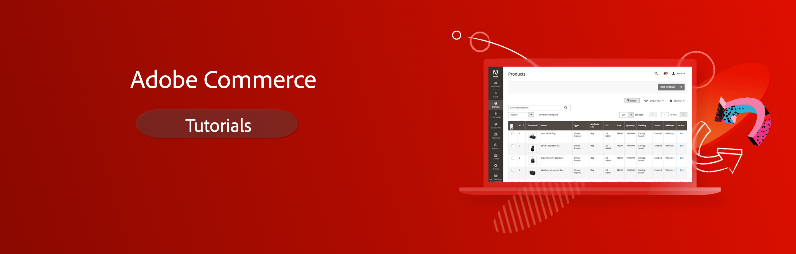

# Commerce Videos and Tutorials {#overview}

Welcome to the Commerce videos and tutorials collection. Using these resources, along with the [documentation](https://experienceleague.adobe.com/docs/commerce.html), give you a better understanding how to use Commerce to support your ecommerce business. 

- Explore the content by topic and subtopic in the left navigation
- Use the search field at the top of the page if you know what you are looking for

These basic resources include video series that provide a high-level view of topics, and individual videos that target specific tasks and processes. The collection is designed to provide helpful content for backend developers, frontend developers, system administrators, merchants, and other roles within your organization.

Basic entry-level series for some of the most thorough Commerce courses include:

- [Getting Started with the Adobe Commerce on cloud infrastructure](./cloud/intro-1.md) is a comprehensive overview of key technologies, project structure, deployment phases, and configurations for Adobe Commerce on cloud infrastructure.
- [Introduction to Commerce for developers](./developer/intro-backend-1-1.md) is an overview of the platform for backend developers.
- [Introduction to Commerce for business users](./merchant/introduction/1-1-menus.md) helps anyone get to know the Admin side of Commerce.

## Additional developer series

- [Progressive Web Apps (PWA) for developers (video series)](./pwa/introduction/1-overview.md) What is PWA, and why PWA Studio is the future​. Ease of use for PWA Studio tools. How to work with PWA Studio

- [Page Builder overview for developers (video series)](./developer/page-builder/1-intro-case-studies.md) How Page Builder works, and ways to customize Page Builder

<!---
- **[Security planning for Commerce (video series)](./security/summit-security/1-summit-security.md)**
     
    *How the e-commerce threat landscape is changing. The importance of security for the customer running an e-commerce application and specific processes and practices for securing Magento*
--->

## Additional resources

- [User documentation](https://docs.magento.com/)
- [Developer documentation](https://devdocs.magento.com/)
- [PWA Studio documentation](https://magento.github.io/pwa-studio/)
- [Adobe Digital Learning Services - Adobe Commerce course catalog](https://learning.adobe.com/catalog.html?solution=Adobe%20Commerce)
