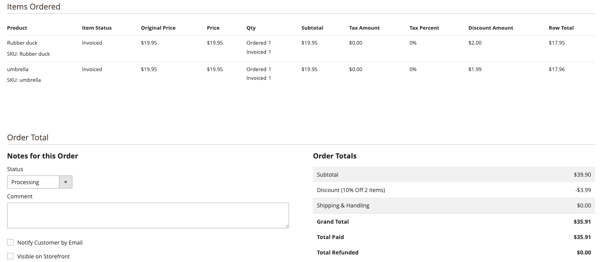

# Create a Cart Price Rule

Cart price rules apply discounts to items in the shopping cart, based on a set of conditions. The discount can be applied automatically when the conditions are met, or when the customer enters a valid coupon code. When applied, the discount appears in the cart under the subtotal. A cart price rule can be used as needed for a season or promotion by changing its status and date range.

## Who is this video for?

- eCommerce marketers
- Website managers

## Video content

>[!VIDEO](https://video.tv.adobe.com/v/343835?quality=12&learn=on)

## Pricing display issues 

There are some unique scenarios that require each line item to display their discount provided but the values may not match exactly.  The reason is when a cart price rule discount is applied to multiple products but the values do not evenly divide into two decimal places.

```PHP
Cart Price Rule = 10% discount applied to 2 products in the cart
Condition for price rule to take effect: total itmes in cart is 2
Actions apply precent of product price discount and that discount amount is 10

2 items are added to the cart, each are $19.95

To get the discount amount multiply the product price times 0.1

19.95 x 0.1 = 1.995

This is the issue, we have 3 decimal places, instead of two. Converting this to dollars is now a problem
```

Now that we know how the problem, what was solution decided by Adobe Commerce for how to deal with this issue.  Thinking about the website owner, who is the only person affected by this issue, it was determined that showing each item ordered with the discount provided in dollars was the most appropriate.  To ensure that the entire order amount calculated properly, it was decided to adust one or perhaps a few items rounding up and the others drop the third decimal.  Let me explain this with another scenario

```PHP
Same 10% discount as above cart rule in effect
Add 2 products to the cart that are 19.95

Each product should get $1.995 in discounts
#1 - 19.95 x 0.1 = 1.995
#2 - 19.95 x 0.1 = 1.995

A grand total of 3.99 is provided as a discount to the customer

When displaying the line items to the store owner in the admin, we need to adjust the first item and round it up to 2.000.  The second items we drop the third decimal 
#1 = 2.00
#2 = 1.99

The total discount of the two products now when summed together match the actual discount provided to a customer.

```

Here is a screenshot of this as it would show in the admin for an order that has this scenario



To explain why we didn't just round both products up and show that amount in the order summary in the Commerce admin involves the sum not matching what was actually provided to the customer when the order was placed.

```PHP

Same 10% discount as above cart rule in effect
Add 2 products to the cart that are 19.95

Each product should get $1.995 in discounts, however if we just round them up, it shows too much discount.
#1 - 19.95 x 0.1 = 1.995
#2 - 19.95 x 0.1 = 1.995

Convert to round up all items
#1 New value is 2.00
#2 New value is 2.00

A grand total of 3.99 was actually provided as a discount to the customer, however if we round up, it would show that $4.00 was given, and that is incorrect.

2.00 + 2.00 = $4.00

```

The same thing goes if we just dropped the third decimal, it would show too little discount provided.

```PHP

Same 10% discount as above cart rule in effect
Add 2 products to the cart that are 19.95

Each product should get $1.995 in discounts, however if we just drop the third decimal, this happens:
#1 - 19.95 x 0.1 = 1.995
#2 - 19.95 x 0.1 = 1.995

Convert to drop the third decimal for all items
#1 New value is 1.99
#2 New value is 1.99

A grand total of 3.99 was actually provided as a discount to the customer, however if we drop the third decimal, it would show that $3.98 was given, and that is incorrect.

1.99 + 1.99 = $3.98

```


## Additional resources

- [Create a Cart Price Rule - [!DNL Commerce] Merchandising and Promotions Guide](https://experienceleague.adobe.com/docs/commerce-admin/marketing/promotions/cart-rules/price-rules-cart-create.html)
- [Coupon Codes - [!DNL Commerce] Merchandising and Promotions Guide](https://experienceleague.adobe.com/docs/commerce-admin/marketing/promotions/cart-rules/price-rules-cart-coupon.html)
